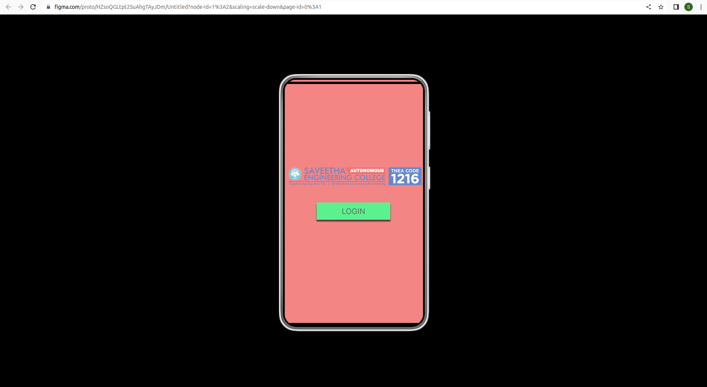
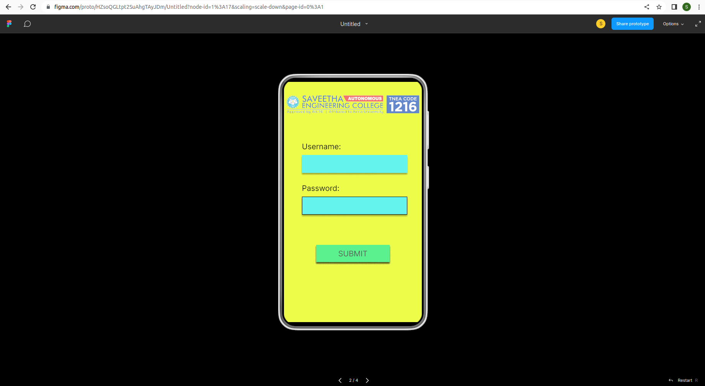
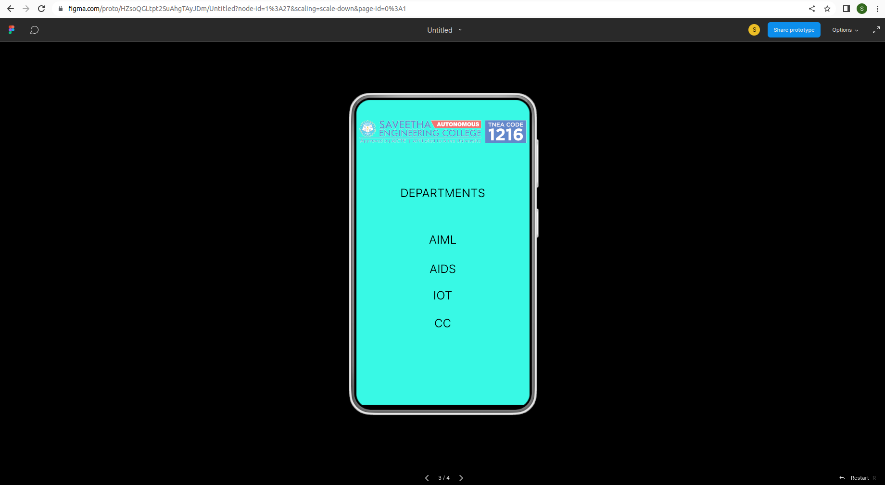

# Event Registration Web Application

## AIM:
To design, develop and deploy a web application for event registration.

## DESIGN STEPS:

## Step 1:
Create a new frame

## Step 2:
select any one preset size of your choice

## Step 3:
select shapes you need

## Step 4:
import images as neeeded

## Step 5:
create pages based on your need and link them

## Step 6:
Validate the HTML and CSS code.

## Step 7:
Publish the website in the given URL.

## DESIGN:
event registration

## PROGRAM :
```
/* Home Page */
position: relative;
width: 360px;
height: 640px;
background: #E63C3C;

/* Login Page */
position: relative;
width: 360px;
height: 640px;
background: #D8F911;

/* WEB_LOGO-01 3 */
position: absolute;
width: 352px;
height: 54px;
left: 4px;
top: 39px;
background: url(WEB_LOGO-01.png);

/* DEPARTMENTS */
position: absolute;
width: 281px;
height: 36px;
left: 39px;
top: 179px;
font-family: 'Inter';
font-style: normal;
font-weight: 400;
font-size: 24px;
line-height: 29px;
text-align: center;
color: #000000;

/* AIML */
position: absolute;
width: 281px;
height: 36px;
left: 39px;
top: 276px;
font-family: 'Inter';
font-style: normal;
font-weight: 400;
font-size: 24px;
line-height: 29px;
text-align: center;
color: #000000;

/* AIDS */
position: absolute;
width: 281px;
height: 36px;
left: 39px;
top: 337px;
font-family: 'Inter';
font-style: normal;
font-weight: 400;
font-size: 24px;
line-height: 29px;
text-align: center;
color: #000000;

/* IOT */
position: absolute;
width: 281px;
height: 36px;
left: 39px;
top: 392px;
font-family: 'Inter';
font-style: normal;
font-weight: 400;
font-size: 24px;
line-height: 29px;
text-align: center;
color: #000000;

/* CC */
position: absolute;
width: 281px;
height: 36px;
left: 39px;
top: 450px;
font-family: 'Inter';
font-style: normal;
font-weight: 400;
font-size: 24px;
line-height: 29px;
text-align: center;
color: #000000;

/* Line 3 */
position: absolute;
width: 360px;
height: 0px;
left: 0px;
top: 640px;
border: 6px solid #000000;

/* SEC Page */
position: relative;
width: 360px;
height: 640px;
background: #0AF1C8;

/* Line 4 */
position: absolute;
width: 360px;
height: 0px;
border: 6px solid #000000;
```
## OUTPUT:






## Result:
The program to design, develop and deploy a web application for event registration is completed successfully.
